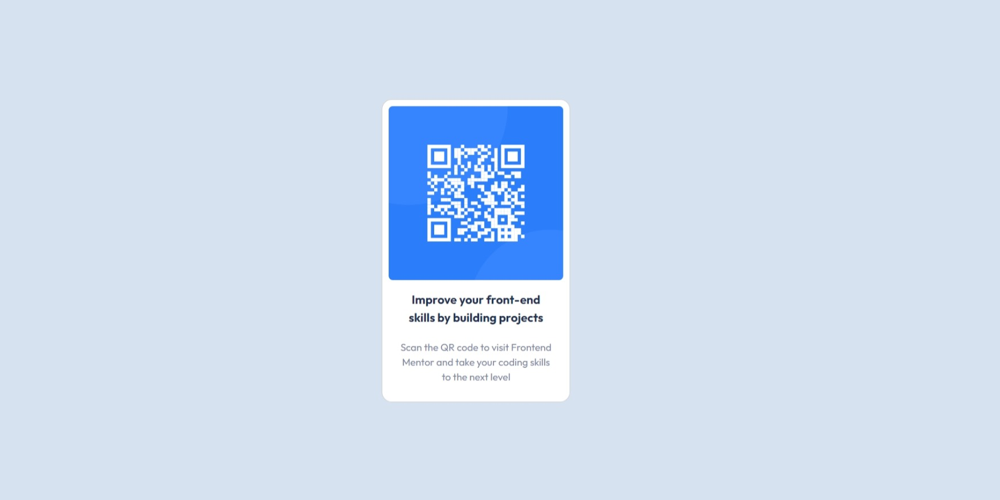

# Frontend Mentor - QR code component solution

This is a solution to the [QR code component challenge on Frontend Mentor](https://www.frontendmentor.io/challenges/qr-code-component-iux_sIO_H). Frontend Mentor challenges help you improve your coding skills by building realistic projects.

## Table of contents

- [Overview](#overview)
  - [Screenshot](#screenshot)
  - [Links](#links)
- [My process](#my-process)
  - [Built with](#built-with)
  - [Useful resources](#useful-resources)
- [Author](#author)

## Overview

The QR Code Component challenge is an excellent starting point for those new to HTML and CSS.

### Screenshot

### Links

- Solution URL: https://github.com/FatehaRsd/qr-code-component
- Live Site URL: https://fateharsd.github.io/qr-code-component/

## My process

### Built with

- Semantic HTML5 markup
- CSS custom properties
- Bootstrap card images (https://getbootstrap.com/docs/5.3/components/card/#images)

### Useful resources

- https://getbootstrap.com/ - This helped me for the responsive sites
- https://www.w3schools.com/ - I'd recommend it to anyone still learning this concept.
- https://developer.mozilla.org/en-US/docs/Web - I'd recommend it to anyone still learning this concept.

## Author

- Website - [Fateha Arsad]https://fateharsd.netlify.app/
- Frontend Mentor - [@FatehaRsd](https://www.frontendmentor.io/profile/FatehaRsd)
- GitHub - [@FatehaRsd](https://github.com/FatehaRsd)
- LinkedIn - [@Nurul Fateha Arsad](https://www.linkedin.com/in/nurulfateharsd/)
